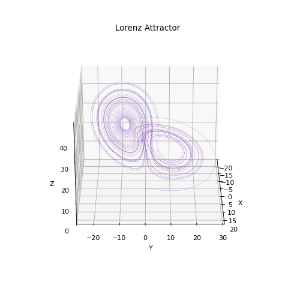
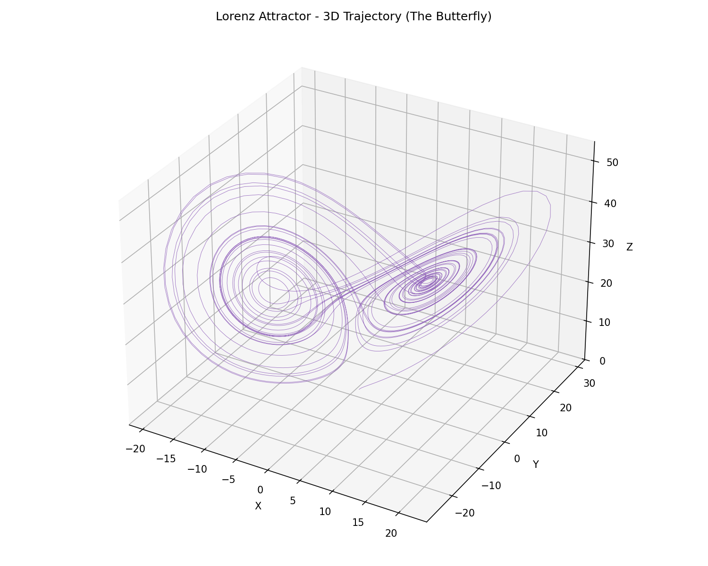
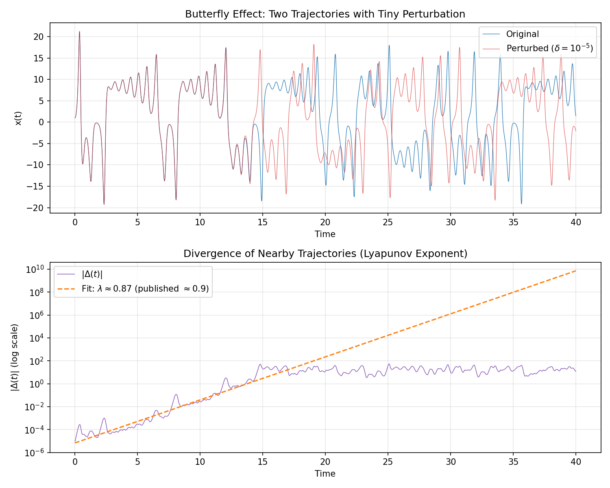
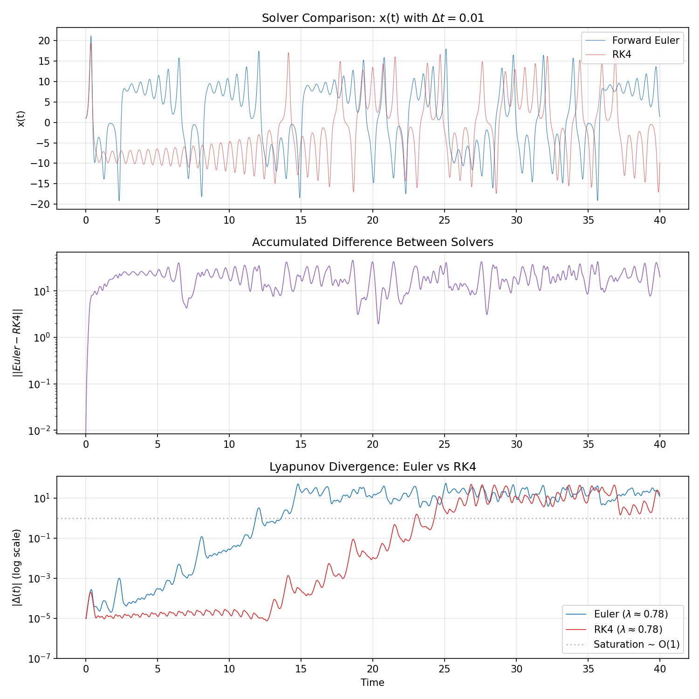
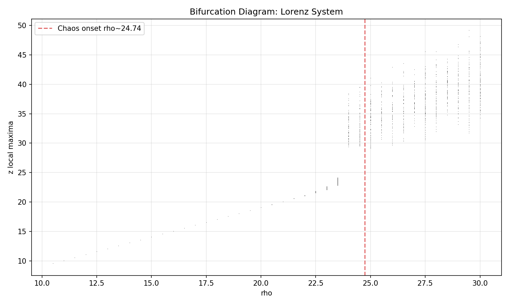
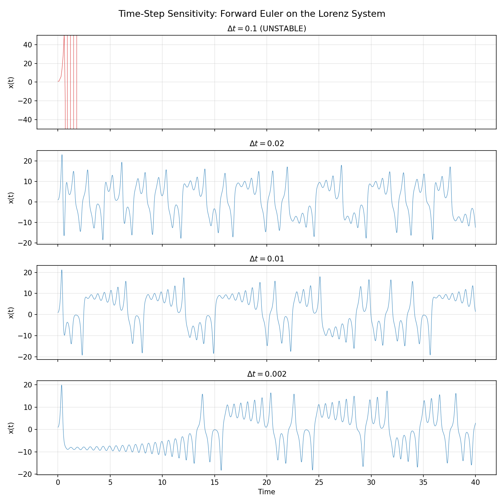

# Lorenz Attractor & Chaos Analysis

Numerical simulation of the Lorenz system with Forward Euler and RK4 solvers, including Lyapunov exponent estimation, bifurcation mapping, and fractal dimension analysis.



## Highlights

- Implemented RK4 and Forward Euler ODE solvers from scratch
- Measured Lyapunov exponent λ ≈ 0.87 (published ~0.905)
- Demonstrated numerical instability of Euler on chaotic systems
- Estimated correlation dimension D₂ ≈ 1.88 (published ~2.06)
- Mapped bifurcation from steady state through periodicity to chaos

## Quick Start

```bash
git clone https://github.com/abhictrl/lorenz-chaos-simulation.git
cd lorenz-chaos-simulation
pip install -r requirements.txt
python main.py
```

**CLI options:**

| Command | Description |
|---------|-------------|
| `python main.py` | Quick demo: 3D trajectory + butterfly effect (~30s) |
| `python main.py --full` | All 9 figure groups (~5–10 min) |
| `python main.py --gif` | Regenerate rotating 3D demo GIF |
| `python main.py --display` | Show plots interactively (default: headless save only) |

Figures are saved to `output/` by default.

## Results Gallery

### 3D Lorenz Attractor (The Butterfly)



The trajectory winds around two lobes corresponding to clockwise and counterclockwise convection rolls — the iconic "butterfly" shape of deterministic chaos.

### Butterfly Effect & Lyapunov Exponent



Two trajectories with initial conditions differing by δ = 10⁻⁵ remain indistinguishable for ~14 time units, then diverge exponentially. Fitted Lyapunov exponent λ ≈ 0.87 matches the published value (~0.905) within 4%.

### Forward Euler vs RK4



With identical Δt = 0.01, Euler and RK4 diverge by t = 3. Euler's per-step error acts like a physical perturbation that chaos amplifies; RK4's error is six orders of magnitude smaller.

### Bifurcation Diagram



Sweeping the Rayleigh number ρ reveals the transition from fixed point → periodic oscillations → chaos at ρ ≈ 24.74.

### Time-Step Sensitivity



Forward Euler blows up at Δt = 0.1. Even stable runs disagree after a few time units because chaos amplifies truncation error.

## Project Structure

```
├── main.py              # CLI entry point
├── solvers/
│   ├── euler.py         # Forward Euler ODE solver
│   └── rk4.py           # 4th-order Runge-Kutta solver
├── lorenz/
│   ├── system.py        # Lorenz rate function & parameters
│   ├── analysis.py      # Lyapunov, bifurcation, fractal dimension
│   └── plots.py         # Figure generation
├── assets/
│   ├── demo.gif         # Rotating 3D animation
│   └── figures/         # Curated result images
└── docs/
    └── index.html       # GitHub Pages landing page
```

## Key Findings

1. **Chaos is in the math, not the noise.** A positive Lyapunov exponent (λ ≈ 0.87) means perturbations double roughly every 0.8 time units — deterministic yet unpredictable.

2. **Forward Euler fails on chaotic systems.** At Δt = 0.01, Euler's trajectory is on a completely different wing of the attractor from RK4 by t = 3. The solver cannot distinguish numerical error from physical perturbation.

3. **Deterministic ≠ predictable.** Individual trajectories diverge, but the attractor shape and statistical properties (fractal dimension, Lyapunov exponents) are reproducible — the same reason climate averages are predictable even when weather is not.

4. **The attractor is fractal.** Correlation dimension D₂ ≈ 1.88 (published ~2.06) confirms the Lorenz attractor has non-integer dimension — more structure than a surface, less than a volume.

## Tech Stack

Python · NumPy · Matplotlib · Pillow


## License

MIT — see [LICENSE](LICENSE).

## References

1. Lorenz, E. N. (1963). "Deterministic Nonperiodic Flow." *J. Atmospheric Sciences*, 20(2), 130–141.
2. Strogatz, S. H. (2015). *Nonlinear Dynamics and Chaos*, 2nd ed. Westview Press.
3. Grassberger, P. and Procaccia, I. (1983). "Measuring the Strangeness of Strange Attractors." *Physica D*, 9, 189–208.
